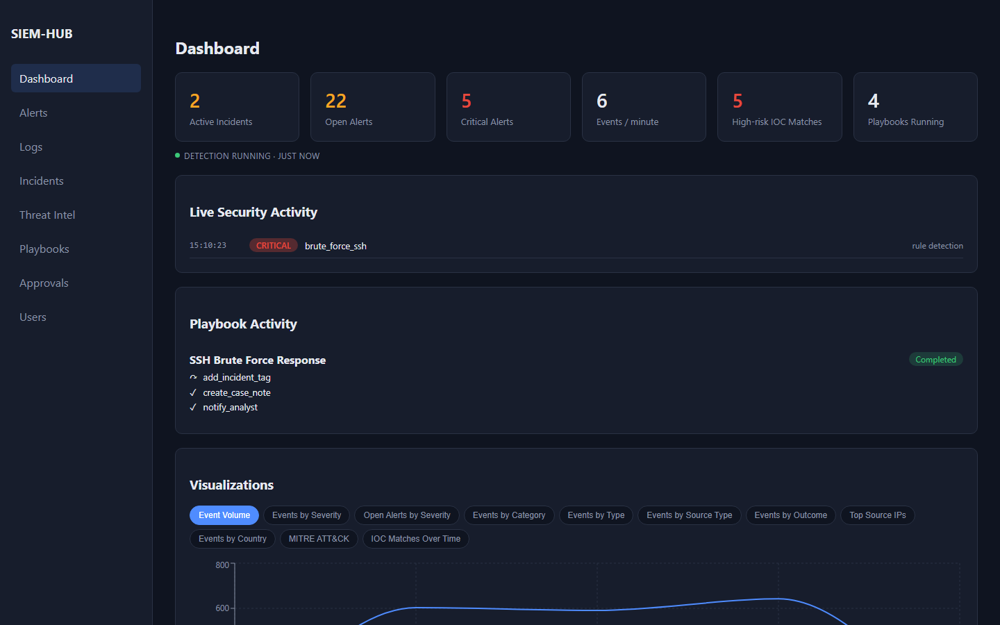
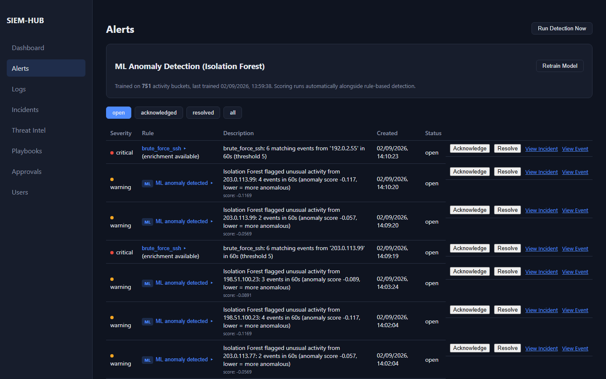
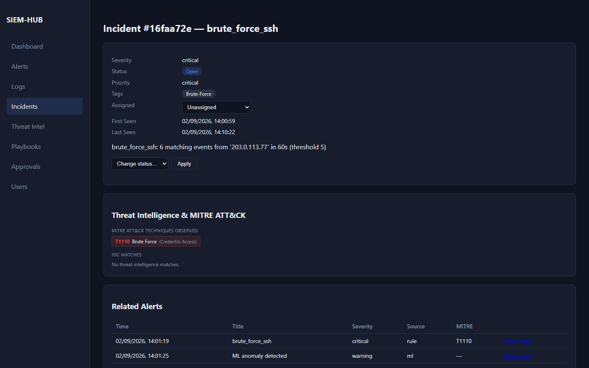
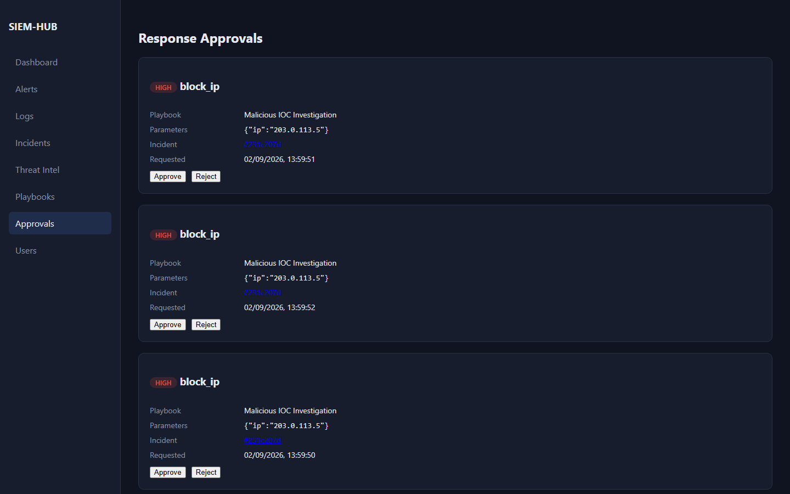
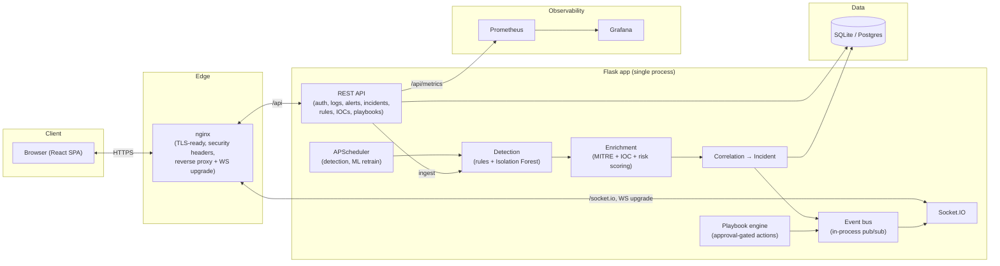

# SIEM-HUB

[](https://github.com/Babilalewis20004/SIEM-HUB/actions/workflows/security.yml)
[](LICENSE)
[](backend/requirements.txt)
[](frontend/package.json)
[](backend/requirements.txt)
[](docker-compose.yml)
[](observability)
[](observability)
[](backend/app/services/ml_detection.py)

A real-time Security Information & Event Management platform — log
ingestion, rule-based + ML anomaly detection, MITRE ATT&CK/IOC enrichment,
incident correlation, and human-approved automated response — built with
Flask + React from the ground up as a full SOC workflow, not a log viewer.
Every claim below (test counts, load-test numbers, the screenshots) is a
real, captured artifact from a live run of this exact codebase, not a
description of intended behavior.

## Screenshots

| Dashboard | Alerts (MITRE + IOC enrichment) |
|---|---|
|  |  |

| Incident detail | Approval-gated response |
|---|---|
|  |  |

More: [Incidents](docs/screenshots/03-incidents.png) ·
[Threat Intel](docs/screenshots/05-threat-intel.png) ·
[Log Explorer](docs/screenshots/06-log-explorer.png) ·
[Playbooks](docs/screenshots/07-playbooks.png)

## At a glance

**What I built** — a SOC platform end to end, not a dashboard bolted onto a
database: log ingestion → normalization → two independent detection
engines (rules + ML) → MITRE ATT&CK/IOC enrichment → deterministic,
explainable correlation into incidents → automated response that's
gated behind human approval — with everything streamed live to connected
analysts over WebSockets and enforced through real RBAC.

**Why I built it** — to prove security-engineering judgment, not just
CRUD skills. Most portfolio projects stop at "logs in, dashboard out." I
wanted the harder parts a real SOC tool needs to get right: an auth
architecture that survives a stolen token (rotating refresh cookies +
reuse detection), automation designed to fail safe (closed action
registry, server-side approval floor) rather than just demo well, and a
CI pipeline that actually blocks merges on real findings instead of a
green checkmark for show.

**Technologies** — Flask/SQLAlchemy/JWT + React/Vite, scikit-learn
(Isolation Forest) for anomaly detection, Flask-SocketIO for real-time
push, Docker Compose, Prometheus + Grafana. Full breakdown in
[Tech stack](#tech-stack).

**What security problems it solves**
| Problem | How |
|---|---|
| Credential stuffing / brute force | Rate limiting + threshold detection, auto-tagged MITRE T1110 |
| Stolen/leaked session tokens | 15-min JWT + rotating HttpOnly refresh cookie with reuse detection (a replayed token revokes every session) |
| Alert fatigue | Deterministic, scored correlation collapses duplicate alerts into one incident |
| Unreviewed automated response | Server-side approval floor on high-risk actions; a requester can never approve their own request |
| Arbitrary code execution via automation | Closed, static playbook action registry — no dynamic dispatch on user input |
| Unknown / novel attack patterns | ML (Isolation Forest) flags anomalous traffic no rule was written for |
| Privilege escalation | Central RBAC registry + self-escalation and last-admin-lockout guards |
| Vulnerable dependencies / leaked secrets | 8 blocking CI gates (gitleaks, bandit, pip-audit, npm audit, CodeQL, Semgrep, Trivy, ZAP) |

Full detail: [Security](#security).

**Key architectural decisions**
- A normalized `Event` schema so detection code never knows which parser
  produced an event — adding a new log source touches zero detection code.
- **Two** detection engines, not one — deterministic rules and ML catch
  different things (see [Example detection scenarios](#example-detection-scenarios)
  for a real case where ML flagged an attack before the rule did).
- Correlation is deterministic and scored, *not* ML — an analyst can
  always see exactly why two alerts were grouped, never a black box.
- An in-process event bus decouples detection from WebSocket broadcast —
  no Redis needed at this scale, with a documented upgrade path if that
  changes.
- Automation is sandboxed by design: a closed action registry and mock
  response providers mean the blast radius of a playbook bug is zero,
  not "whatever `block_ip` happens to touch."
- SQLite for dev, Postgres for production — one config change, not a
  rewrite (see [Deployment](#deployment)); no infrastructure this project
  doesn't need yet.

Full detail: [Architecture](#architecture).

**How to run it** — `docker compose up --build`, then seed demo data.
Full steps: [Quick Start](#quick-start).

**How I tested it** — 243 backend tests passing, 87% coverage (real
numbers from this session's run), plus a real Locust load test. Just as
important: three real bugs in this project were caught only by manually
running the live stack, not by pytest — see [Testing](#testing) and
[Performance](#performance) for both the numbers and that story.

**What I learned**
- A green test suite doesn't prove background-thread code is correct — a
  real bug in the playbook engine (an unguarded `request.remote_addr`
  call) only broke on a real background thread; pytest's request-context
  fixture silently masked it. The fix was a runtime guard *and* a
  regression test that reproduces the bug from a real thread on purpose.

## Contents

- [At a glance](#at-a-glance)
- [Features](#features)
- [Architecture](#architecture)
- [Quick Start](#quick-start)
- [Example detection scenarios](#example-detection-scenarios)
- [Testing](#testing)
- [Performance](#performance)
- [Security](#security)
- [Deployment](#deployment)
- [Structure](#structure)
- [Auth](#auth)
- [Running with Docker](#running-with-docker)
- [How detection works](#how-detection-works)
- [ML anomaly detection](#ml-anomaly-detection-isolation-forest)
- [Ingesting logs](#ingesting-logs)
- [Tech stack](#tech-stack)

## Features

- **Detection, two independent engines** — configurable threshold rules
  (e.g. 5+ failed logins from one IP in 60s) *and* an Isolation Forest ML
  model that flags anomalous traffic shapes no rule was ever written for,
  running side by side on every ingested event.
- **Real-time SOC operations** — WebSocket push (Flask-SocketIO) streams
  new alerts, incident updates, and playbook progress to every connected
  analyst live, with a synchronous in-process event bus decoupling
  detection from broadcast.
- **MITRE ATT&CK + threat intel enrichment** — alerts are auto-tagged with
  ATT&CK techniques, matched against an IOC table (IP/domain/URL/hash),
  and given a blended risk score — never a black box, every score and
  correlation decision is stored with its own reasoning.
- **Deterministic alert correlation → incidents** — a scored engine (same
  source IP/host/user/category/IOC, time-window proximity) groups related
  alerts into one Incident with a full investigation state machine, instead
  of flooding analysts with duplicate noise.
- **Playbook automation with human-gated approval** — declarative
  playbooks run registered, validated actions automatically; anything
  high/critical risk always parks for approval, with separation-of-duties
  enforced server-side (you can never approve your own request).
- **RBAC** — admin/analyst/viewer roles enforced through one central
  permission registry on every route, not scattered `if role ==` checks.
- **Observability** — structured JSON logging, liveness/readiness health
  endpoints, and Prometheus metrics, wired into a Grafana dashboard out of
  the box.

## Architecture



Full pipeline detail (the normalised `Event` schema, parser architecture,
RBAC internals, the correlation scoring model, the playbook engine's
approval/idempotency design, and every documented trade-off) is in
[`docs/ARCHITECTURE.md`](docs/ARCHITECTURE.md) — the above is the
map, that's the territory.

## Quick Start

Everything runs in Docker — no Python, Node, or database setup needed on
your machine.

**Prerequisites:**
- [Docker Desktop](https://www.docker.com/products/docker-desktop/) (includes
  Docker Compose) installed and running
- Ports `8080`, `5000`, `9090`, and `3000` free on your machine
- ~5 minutes and about 2GB of disk space for images

**Steps:**

1. **Get the code:**
   ```bash
   git clone https://github.com/Babilalewis20004/SIEM-HUB.git
   cd SIEM-HUB
   ```

2. **Create the backend's environment file** (a template with safe demo
   defaults — no values need to be changed to try the app out):
   ```bash
   cp backend/.env.example backend/.env
   ```

3. **Build and start everything** (backend API, frontend, Prometheus,
   Grafana). First run takes a few minutes to download images and build;
   later runs are fast:
   ```bash
   docker compose up --build
   ```
   This runs in the foreground and streams logs from every service. Leave
   it running and open a **second terminal** in the same `SIEM-HUB` folder
   for the next step. (Prefer one terminal? Run `docker compose up --build -d`
   instead to start in the background, then use `docker compose logs -f` if
   you want to watch the logs.)

4. **Seed sample data** (one-time, in the second terminal — creates a demo
   admin account, default detection rules, and ~3 hours of sample log
   traffic so the dashboard isn't empty):
   ```bash
   docker compose exec backend python seed.py
   ```

5. **Open the app:** go to **http://localhost:8080** in your browser and
   log in with:
   - **Email:** `admin@example.com`
   - **Password:** `changeme123`

   You should land on a dashboard with alerts, event volume charts, and
   MITRE ATT&CK detail already populated from the seeded data. Try the
   **Alerts**, **Log Explorer**, **Incidents**, and **Threat Intel** pages
   from the nav, or trigger a fresh detection pass with
   `POST http://localhost:5000/api/alerts/run-detection`.

6. **When you're done**, stop everything with `Ctrl+C` in the first
   terminal, then:
   ```bash
   docker compose down          # stop containers, keep the seeded data
   docker compose down -v       # stop containers AND delete the data (fresh start next time)
   ```

**Also available once the stack is up:**
- Backend API directly: http://localhost:5000 (e.g. `GET /api/health`)
- Prometheus: http://localhost:9090
- Grafana: http://localhost:3000   (default login: username:admin password:admin)

**If something doesn't come up:** run `docker compose ps` to check
container status, or `docker compose logs backend` (swap in `frontend`,
`prometheus`, etc.) to see what a specific service is doing. A common cause
of failure is one of the ports above already being used by something else
on your machine — stop that other process or edit the port mappings in
`docker-compose.yml`.

See [Running with Docker](#running-with-docker) below for more detail on
what the stack is doing, and the rest of this README for how the
application itself works.

## Example detection scenarios

Three real, executed walkthroughs — actual `curl` requests and their real
JSON responses against a live seeded stack, not hypothetical examples —
live in [`docs/SCENARIOS.md`](docs/SCENARIOS.md):

1. **SSH brute force** — raw log lines in → threshold rule fires → MITRE
   T1110 tagged → correlated into an Incident → an automated playbook
   tags/notes/notifies with no human step needed.
2. **ML catches what no rule was written for** — the same traffic flagged
   by the Isolation Forest model *before* it was even large enough to trip
   the threshold rule, because the shape of the traffic was already
   off-baseline.
3. **IOC match → human-approved response** — a known-malicious IP triggers
   an investigation playbook; its low-risk steps run automatically, its
   `block_ip` step parks for approval (separation-of-duties enforced —
   the triggering user can't self-approve), an admin approves it, and the
   (mocked) block executes.

## Testing

```
243 passed in 140.62s   ·   87% line coverage (backend)
```

Real output from this session's run of the full backend suite (models,
parsing, detection, RBAC, correlation, playbooks, refresh-token rotation,
audit logging). No automated frontend test suite exists yet — an honest,
current gap, not hidden. Full breakdown, what's covered where coverage is
lower, and why some bugs were only ever caught by running the live stack
rather than pytest: [`docs/TESTING.md`](docs/TESTING.md).

## Performance

```
20 concurrent users, 60s, shared session:  776 requests, 0 failures
Aggregate:  13.2 req/s   ·   p50 98ms   ·   p95 910ms   ·   p99 1300ms
```

Real Locust run against the actual `docker compose` stack on one dev
laptop (SQLite, single Flask process) — not a production capacity claim,
a demonstration the detection→correlation→API pipeline holds up under
concurrent load. Also documented: what happened when 20 users each tried
to log in independently (the login rate limiter correctly rejected most of
them — a real, useful finding, not a bug). Methodology, full numbers, and
where these would move first in production:
[`docs/PERFORMANCE.md`](docs/PERFORMANCE.md).

## Security

JWT access tokens (15-minute expiry) backed by a rotating, single-use,
HttpOnly-cookie refresh session with reuse detection; RBAC enforced through
one central permission registry; per-IP rate limiting on auth/upload
routes; a playbook engine with no dynamic code execution and a server-side
approval floor on high-risk actions; CSP/security headers and Host
allow-listing at the edge. Every push/PR runs 8 blocking CI gates —
gitleaks, bandit, pip-audit, npm audit, CodeQL, Semgrep, Trivy, and OWASP
ZAP DAST. Full writeup, the RBAC permission matrix, and the documented,
deliberate trade-offs (SQLite single-writer, threading async mode, mock
response providers): [`docs/SECURITY.md`](docs/SECURITY.md).

## Deployment

The Quick Start above is tuned for trying the app locally. Running it for
real changes several things — Postgres instead of SQLite, gunicorn+eventlet
instead of the dev server, real TLS termination, Redis-backed rate
limiting/WebSocket fan-out if you scale past one worker — each documented
with exactly what to change, plus a generic cloud-VM walkthrough that works
on any VPS: [`docs/DEPLOYMENT.md`](docs/DEPLOYMENT.md).

## Structure

```
SIEM-HUB/
├── backend/          Flask API
│   ├── app/
│   │   ├── models/       Event (canonical), Log (deprecated alias), Alert, Rule, User, Incident, MITRE, IOC, Playbook
│   │   ├── parsers/      base.py + ssh, nginx, apache, firewall, windows_security, syslog — format-specific extraction
│   │   ├── routes/       auth, logs, alerts, stats, rules, incidents, iocs, mitre, playbooks, users, audit, health
│   │   ├── services/     normalization, validation, detection, ml_detection, correlation, enrichment, risk_scoring
│   │   ├── playbooks/    engine, registry, validators, providers (action automation)
│   │   ├── events/       in-process pub/sub bus + Socket.IO broadcaster
│   │   ├── ws/           WebSocket auth + handlers
│   │   └── ml_models/    persisted trained model (isolation_forest.joblib)
│   ├── migrations/    Flask-Migrate/Alembic schema history
│   ├── tests/          pytest suite + tests/load/ (Locust, standalone)
│   ├── config.py / run.py / seed.py / requirements.txt
├── frontend/          React (Vite)
│   └── src/
│       ├── api/client.js     Axios wrapper (JWT, silent refresh-and-retry on 401)
│       ├── context/          Auth, Permission, Realtime contexts
│       ├── services/websocket.js
│       ├── pages/            Dashboard, Alerts, Logs, Incidents, IOCs, Playbooks, Approvals, Users
│       └── components/
├── scripts/screenshots/  Playwright script regenerating docs/screenshots/
├── observability/     Prometheus + Grafana config
└── docs/              ARCHITECTURE, SECURITY, DEPLOYMENT, TESTING, PERFORMANCE, SCENARIOS
```

## Auth

JWT access tokens (`app/utils/auth.py` + `app/routes/auth.py`), backed by
a rotating HttpOnly-cookie refresh session — full design in
[`docs/SECURITY.md`](docs/SECURITY.md). Quick reference:

- `POST /api/auth/register` — first user becomes `admin`, everyone after
  starts as `viewer`; an admin promotes via `PATCH /api/users/<id>/role`.
- `POST /api/auth/login` — returns `{"token": "...", "user": {...}}` plus
  an HttpOnly refresh cookie.
- `POST /api/auth/refresh` / `POST /api/auth/logout` — rotate / revoke.
- `GET /api/auth/me` — current user for a valid token.
- Every other route requires `Authorization: Bearer <token>` plus a
  per-route RBAC permission check (`app/auth/permissions.py`).
- `REQUIRE_AUTH=false` disables auth entirely for local curl testing.
- `/api/auth/login`, `/api/auth/register`, `/api/auth/refresh`, and
  `/api/logs/upload` are per-IP rate-limited (Flask-Limiter).

`seed.py` creates **admin@example.com / changeme123** — log in, then
change the password or delete the account and register your own. Don't
ship this default in anything real.

## Running with Docker

```bash
cp backend/.env.example backend/.env   # fill in real SECRET_KEY/JWT_SECRET_KEY if you don't have one yet
docker compose up --build
docker compose exec backend python seed.py   # first run only: admin user + sample data
```

- Frontend (nginx-served SPA, reverse-proxying `/api` and `/socket.io` to the
  backend): http://localhost:8080
- Backend API directly: http://localhost:5000
- Prometheus: http://localhost:9090 · Grafana: http://localhost:3000
- `siem.db` and the trained ML model persist in named volumes (`siem-db`,
  `ml-models`) across `docker compose down` (not `-v`)
- The backend container runs migrations (`flask db upgrade`) automatically
  on startup — see `backend/docker-entrypoint.sh`
- `observability/docker-compose.yml` is a separate, lighter stack (just
  Prometheus + Grafana, scraping a backend run directly on the host via
  `python run.py`) for when you don't want the full container stack

Schema is managed by Flask-Migrate (`flask db upgrade`/`flask db migrate`) —
`db.create_all()` is no longer called automatically on startup except for
ephemeral test databases (`AUTO_CREATE_DB=true`, set by the pytest config)
and a fresh Docker volume with no tables yet (`backend/docker-entrypoint.sh`
detects that case and bootstraps the schema from the current models instead
of running the migration chain, which assumes a pre-existing database).

Detection runs automatically every 30s via APScheduler (configurable in
`config.py`), or trigger manually: `POST /api/alerts/run-detection`.

### Running tests

Tests run against a local Python environment, not the Docker image (there's
no test stage in `backend/Dockerfile`) — see [Testing](#testing) and
[`docs/TESTING.md`](docs/TESTING.md) for real results:

```bash
cd backend
python3 -m venv venv && source venv/bin/activate
pip install -r requirements.txt
pytest --cov=app --cov-report=term-missing
```

## How detection works

Both layers, in `app/services/detection.py`, read normalised `Event`
records only (`source_ip`, `event_type`, `category`, `outcome`,
`timestamp`) — neither has any SSH- or Nginx-specific logic. See
[`docs/ARCHITECTURE.md`](docs/ARCHITECTURE.md) for the full pipeline.

1. **Threshold rules** — stored in the `rules` table, editable via
   `/api/rules`. Example: 5+ `authentication_failure` events from the same
   `source_ip` within 60s → alert. Conditions can filter by `event_type`
   and/or `category`. Add your own via `POST /api/rules`:
   ```json
   {
     "name": "port_scan",
     "rule_type": "threshold",
     "condition": {"category": "web", "count": 30, "window_seconds": 30, "group_by": "source_ip"},
     "severity": "critical"
   }
   ```
2. **Off-hours heuristic** — built-in example flagging authentication
   activity between 00:00–05:00 server time. Swap in a real statistical
   baseline (rolling average per host) as a next step.

## ML anomaly detection (Isolation Forest)

Complements the rule-based engine by catching *unknown* unusual patterns
instead of only known-bad ones. Lives in `app/services/ml_detection.py`.
See [Example detection scenarios](#example-detection-scenarios) for a real
captured example of it flagging traffic before the corresponding rule did.

**Pipeline:**
1. Logs are bucketed by `(source_ip, 60s window)` — configurable via
   `ML_BUCKET_SECONDS`
2. Each bucket becomes a 10-feature vector: event count, distinct event
   types, failed logins, HTTP errors, unique paths/users touched, avg
   response size, off-hours flag, and critical+high / medium+low severity
   counts (`FEATURE_NAMES` in `ml_detection.py`) — computed from `Event`
   fields (`event_type`, `category`, `outcome`, `severity`, `parsed_fields`)
3. `train_model()` fits a `StandardScaler` + `IsolationForest` on historical
   buckets and persists both to `app/ml_models/isolation_forest.joblib`
4. `run_ml_detection_job()` scores recent completed buckets against the
   saved model; outliers become `Alert` rows with `rule_name:
   "ml_isolation_forest"` and the anomaly score + feature values in `context`

**Using it:**
- `python seed.py` seeds ~3 hours of baseline traffic and trains the model
  automatically, so the dashboard has something to score against on first run
- `POST /api/alerts/train-model` — (re)train on the last `ML_TRAINING_LOOKBACK_HOURS`
  of data (optionally pass `{"lookback_hours": N}`)
- `GET /api/alerts/ml-status` — check whether a model exists and when it was trained
- `POST /api/alerts/run-detection` — runs both the rule-based engine and ML
  scoring in one pass; also runs automatically every `DETECTION_INTERVAL_SECONDS`
  once a model exists
- The frontend Alerts page has a "Train Model" panel and tags ML-origin
  alerts with an `ML` badge + anomaly score

**Tuning notes:**
- `ML_CONTAMINATION` (default `0.05`) controls how sensitive the model is —
  lower it if you're seeing too many false positives on small/synthetic
  datasets, raise it if real attacks are being missed
- `ML_MIN_TRAINING_SAMPLES` (default `15`) is a low bar for demo purposes;
  a real deployment wants far more historical buckets before trusting the
  model
- Retraining also happens automatically every `ML_RETRAIN_INTERVAL_SECONDS`
  (default 6h) via APScheduler, on the same rolling
  `ML_TRAINING_LOOKBACK_HOURS` window the manual endpoint uses — set
  `ML_AUTO_RETRAIN_ENABLED=false` to go back to manual-only (the
  endpoint/button always still works either way)

## Ingesting logs

- `POST /api/logs/upload` — multipart file upload (`file` field), one log
  line per row, or JSON: `{"source": "nginx", "host": "web01", "lines": [...]}`
- Pipeline: parse → normalise → validate → store (see
  [`docs/ARCHITECTURE.md`](docs/ARCHITECTURE.md)). One malformed line never
  fails the whole batch; the response reports
  `{total_lines, parsed, normalised, failed, stored}`.
- Parsers currently understand SSH auth lines (failed + accepted, both
  syslog and ISO timestamps, IPv4/IPv6), Nginx/Apache combined/common access
  log format, Linux firewall (iptables/UFW) LOG lines, Windows Security
  logon events (4624/4625, one JSON object per line), and a generic syslog
  envelope (RFC 3164/5424) that recovers hostname/tag/severity from any
  syslog-wrapped line no more specific parser claims; anything left
  unmatched is stored as `event_type: "unparsed"` so nothing is dropped.
  Add a new format by writing a parser in `app/parsers/` + a normaliser in
  `app/services/normalization.py` — see `docs/ARCHITECTURE.md` for the
  extension pattern, including how `source_hint` (e.g. `source: "apache"`
  on upload) disambiguates formats that are byte-for-byte identical to
  another parser's.
- `GET /api/logs` supports filtering by `source_type`, `event_type`,
  `category`, `severity`, `source_ip`, `destination_ip`, `hostname`,
  `username`, `outcome`, `start`/`end`, and free-text `q`, plus
  `sort`/`order` (severity sorts by actual level, not alphabetically).
- `GET /api/logs/grouped?group_by=<field>` aggregates that same filtered
  set into per-value counts (with max severity and last-seen) — any field
  `GET /api/logs` can filter by. The Log Explorer's "Group by" view uses
  this; clicking a group row drills back into the raw filtered list.

## Tech stack

| Layer | Technology |
|---|---|
| Backend | Flask 3.1, SQLAlchemy, Flask-Migrate (Alembic), Flask-SocketIO, Flask-Limiter, PyJWT |
| Detection | scikit-learn (Isolation Forest), rule-based threshold engine |
| Database | SQLite (dev/demo) → Postgres (production, see [DEPLOYMENT.md](docs/DEPLOYMENT.md)) |
| Frontend | React 18, Vite, react-router-dom, @tanstack/react-query, Recharts, socket.io-client |
| Observability | Prometheus, Grafana, structured JSON logging |
| CI/Security | GitHub Actions — gitleaks, bandit, pip-audit, npm audit, CodeQL, Semgrep, Trivy, OWASP ZAP |
| Containerization | Docker, Docker Compose, nginx (SPA + reverse proxy) |

## License

[MIT](LICENSE)
